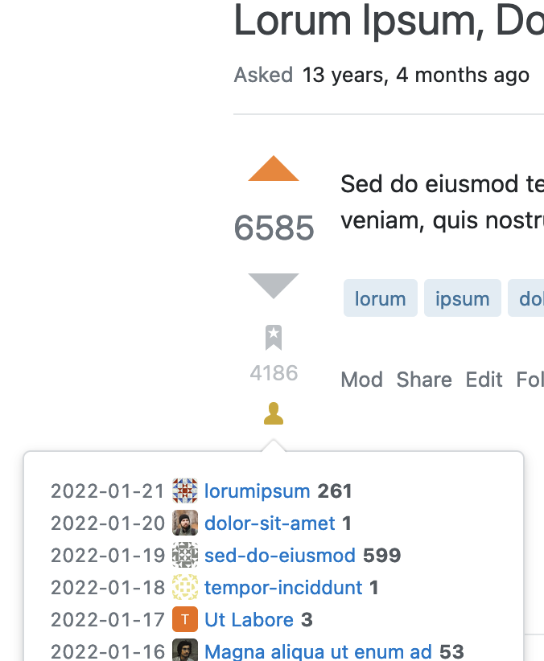

# Bookmark users

Userscript to fetch the list of users that bookmarked a question on any Stack Exchange website.

This script uses the [Stack Exchange Data Explorer](https://data.stackexchange.com/) to fetch the list of users and augments this with user information from the [Stack Exchange API](https://api.stackexchange.com/).

Simply click the person icon below the bookmark icon to open the list. Note that the icon is only visible when there is at least one bookmark. Bookmarking users are listed in the order in which they created their bookmarks, newest to oldest.

## Limitations

The Data Explorer database is refreshed once a week, so the list of users can be up to 7 days out of date.

The Data Explorer only permits 100 unique queries per hour, per IP address. The query for a given question is cached however. This script only starts the query when you click the icon, so unless you plan to retrieve the bookmarking users for hundreds of pages or are on a very busy IP address with multiple users running this script, you should not run into the limit.

However, once you are over the limit, continueing to send queries can result in being blacklisted; make sure not to hit 130 queries in a single hour. Future versions of this script may detect when you are rate limited and prevent further queries.

## License

This script is [MIT licensed](../../LICENSE).

## Issues and suggestions

[][issues]
[][prs]

Feature requests and bug reports are most welcome, please use the [GitHub issue tracker][issues]. Issues with accompanying [pull requests][prs] are even more awesome!

[issues]: https://github.com/mjpieters/SO-userscripts/issues?q=is:issue+is%3Aopen+label:bookmark-users
[prs]: https://github.com/mjpieters/SO-userscripts/pulls?q=is:pr+is%3Aopen+label:bookmark-users