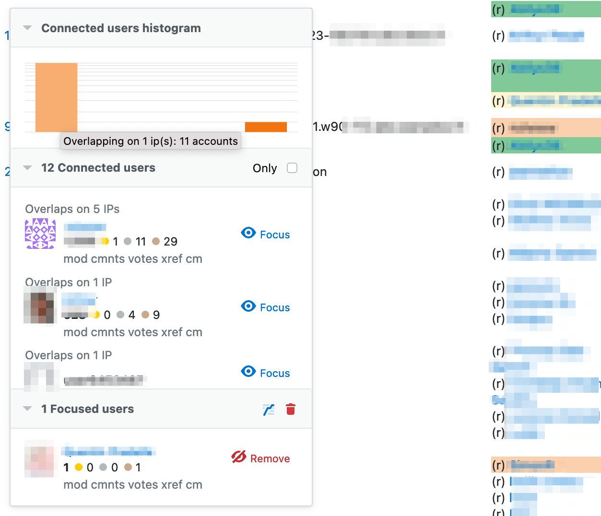

# ♦ Connected Users

> [!WARNING]
> This repository is no longer being maintained. Use the code here at your own risk, I am no longer a moderator and can't fix these.

> **Warning**  
> This userscript only works for sites where you have ♦ elected moderator access.

[![current version][badge_current_version]][latest]
[![MIT license][badge_license]](../../LICENSE)
[![Install this userscript][badge_install]][install]

Userscript to aid investigation of connected users on the moderator-only IP cross-reference view.

The script adds tools to show a histogram of connected users, list those users in a separate control, and a list of 'focused' users that determine the time periods (per IP address) that non-focused users could be connected to.

## Installation

[][install]

## Documentation

Due to the sensitive nature of moderator-only tooling, the documentation for this script is maintained [on the (private) Stack Moderators team site](https://stackoverflowteams.com/c/moderators/articles/4997).

## License

This script is [MIT licensed](../../LICENSE).

## Issues and suggestions

[![GitHub issues][badge_issues]][issues]
[![GitHub pull requests][badge_prs]][prs]

Feature requests and bug reports are most welcome, please use the [GitHub issue tracker][issues]. Issues with accompanying [pull requests][prs] are even more awesome!

[latest]: https://github.com/mjpieters/SO-userscripts/releases/latest
[install]: https://github.com/mjpieters/SO-userscripts/releases/latest/download/connected-users.user.js
[issues]: https://github.com/mjpieters/SO-userscripts/issues?q=is:issue+is%3Aopen+label:connected-users
[prs]: https://github.com/mjpieters/SO-userscripts/pulls?q=is:pr+is%3Aopen+label:connected-users

[badge_current_version]: https://img.shields.io/github/v/tag/mjpieters/SO-userscripts?color=green&label=version&logo=github
[badge_license]: https://img.shields.io/github/license/mjpieters/SO-userscripts
[badge_install]: https://img.shields.io/badge/install-Install%20this%20userscript-blue
[badge_issues]: https://img.shields.io/github/issues/mjpieters/SO-userscripts/connected-users?label=issues
[badge_prs]: https://img.shields.io/github/issues-pr/mjpieters/SO-userscripts/connected-users?label=pull+requests
